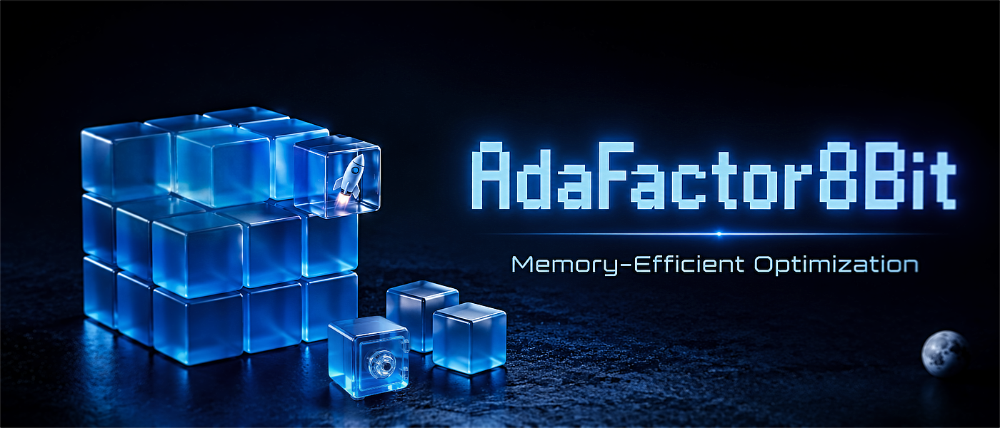

<p align="center">
  <a href="https://github.com/yanfeiwong/adafactor-8bit">
    
  </a>
</p>
<div align="center">

# 8-bit Adafactor with Fused CUDA Kernels

[English](./README.md) | **中文**

[](https://opensource.org/licenses/MIT)
[](https://www.python.org/downloads/)
[](https://pypi.org/project/adafactor8bit/)
[](https://pepy.tech/project/adafactor8bit)
[](https://github.com/yanfeiwong/adafactor-8bit/stargazers)

</div>

这是一个增强版的 8-bit Adafactor 优化器，具备融合 CUDA Kernel 与对数空间分块量化，并支持 4-bit 打包一阶动量、APOLLO 低秩更新和 CAME 置信度引导优化等可选功能，在大幅降低优化器状态显存占用的同时，保持了低开销与数值稳定性，适用于 LLM 和扩散模型等大规模训练场景。

## ⚡ 核心特性

- **对数空间量化**：在 8-bit 量化前，将二阶矩（方差）映射到 log2 空间。这种方式适应了方差的长尾分布，降低了极小的二阶矩估计值被截断为零的风险，提升训练稳定性。
- **CUDA 融合算子**：将反量化、EMA 更新、Warp-Shuffle 归约与重新量化整合到单一 Kernel 中，并利用 `float4` 向量化优化显存带宽使用。
- **可选的 4-bit 一阶动量**：采用 4-bit 均匀量化存储可选的一阶动量（`beta1`），在保持极低显存开销的同时，有效保留动量更新。
- **CAME 置信度引导**：可选的置信度引导自适应内存高效优化（CAME），通过历史动量估计更新置信度，并自适应地抑制不稳定的更新方向，从而提升训练稳定性并减少 Loss 尖峰。
- **APOLLO 子空间投影**：可选的随机子空间投影路径，在低秩空间内估计自适应梯度缩放，防止二阶矩统计信息过时，可能带来更好的收敛与泛化效果。
- **Fira 范数增长限制器**：通过调节更新范数的相对增长来抑制破坏性的梯度尖峰。该机制最初用于 APOLLO 路径，现已同样支持标准的 Adafactor 路径，显著提升训练稳定性，通常允许安全地移除外部梯度裁剪。
- **零同步开销**：重构了控制流，消除了隐式的 CPU-GPU 同步（如 D2H 拷贝），确保 GPU 计算流水线能够无阻塞地异步运行。
- **跨平台 JIT 编译**：使用即时编译（JIT），在 Windows 和 Linux 环境下均可便捷配置。

## 📊 性能表现

- **显存占用**：得益于 Adafactor 的分解二阶矩估计、8-bit 量化以及可选的 4-bit 打包一阶动量，优化器状态的显存占用通常远低于 `AdamW8Bit`，有助于大幅缓解显存受限环境下的压力。
- **训练速度**：融合算子设计与减少的同步开销，使其能够实现与主流 8-bit 优化器相当的单步（step）耗时。
- **量化精度**：Adafactor 的二阶矩（方差）严格非负且跨越多个数量级。通过将其映射到 log2 空间的 `UINT8` 而非线性空间，优化器为极小方差保留了相对精度，缓解了标准 8-bit 量化中异常梯度引起的不稳定性。

## 📦 安装

这个项目采用 JIT (Just-In-Time) 编译，无预编译二进制文件。

请确保你的环境中已安装 `torch` 和 `ninja`，并配置好了 CUDA 编译器（如 MSVC 或 GCC）。

如果 CUDA 编译失败，优化器会自动回退到纯 PyTorch 实现。

### From PyPI

```bash
pip install -U adafactor8bit
```

### From Source

```bash
pip install git+https://github.com/yanfeiwong/adafactor-8bit.git
```

> [!IMPORTANT]
> **首次编译**：首次实例化优化器（或运行示例代码）时，会自动触发 CUDA 源码的 JIT 编译。这可能需要几十秒到几分钟的时间（取决于您的硬件与编译器），期间终端可能无明显输出，请耐心等待。编译完成后结果会被自动缓存，后续无需等待。

## 🚀 快速开始

就像使用标准优化器那样简单。

```python
from adafactor8bit import Adafactor8Bit

optimizer = Adafactor8Bit(model.parameters(), lr=1e-3)
```

> [!TIP]
> 直接传入 `model.parameters()` 可快速跑通。生产环境建议使用 `param_groups` 保护敏感层（Norms、Biases）。对于**稀疏 Token Embedding**（大词表 + 小 batch），请参阅[进阶示例](#-进阶示例)以规避冷启动方差爆炸。

```python
from adafactor8bit import Adafactor8Bit

def get_param_groups(model, weight_decay=1e-2):
    decay, no_decay = [], []
    for name, param in model.named_parameters():
        if not param.requires_grad: continue
        # 保护 1D 张量、bias、norm 和 embedding
        if param.ndim <= 1 or "bias" in name or "norm" in name or "embed" in name:
            no_decay.append(param)
        else:
            decay.append(param)
            
    return [
        {"params": decay, "weight_decay": weight_decay, "quantize": True},
        {"params": no_decay, "weight_decay": 0.0, "quantize": False}
    ]

model = MyModel().cuda()
optimizer = Adafactor8Bit(
    get_param_groups(model), 
    lr=1e-3, 
    # 如果希望长期连续训练或者搭配外部学习率调度
    relative_step=False,     # 禁用内部 LR 调度，使用外部传入的固定 LR
    beta2=0.999,             # 锁定 EMA 窗口，适合长期连续微调
)

# Training loop...
```

## 🛠️ 进阶示例

这里我们展示针对复杂混合架构模型（例如 Vision-Language Models, Diffusion UNets 等），如何通过**混合分组**策略来尽可能实现稳定高效的训练。

| 层类型 | 策略 |
|--------|------|
| **1D / 敏感小参数** (Norms, Biases) | 不量化，不做权重衰减。 |
| **Embedding 层** | `factored=False`，`scale_parameter=False`，`d=1e9` → 等效于**没有一阶动量的 Adam**。配合 Adam 级别的学习率，实现 Token 级精细更新，避免冷词连坐。 |
| **2D 权重** (线性层) | 8-bit量化，权重衰减，**APOLLO** 路径。不断切换的随机子空间投影捕获更全面的梯度信息，并起到正则化作用。 |
| **>2D 权重** (Conv2d 等) | 8-bit量化，权重衰减，**全秩且禁用RMS缩放**（`factored=False`, `scale_parameter=False`）。牺牲一定显存保留空间结构，换取更精细的优化效果。 |
| **一阶动量**（`beta1`） | 仅对密集权重矩阵启用。在这些层上，优化收益通常远大于 4-bit 打包一阶动量带来的显存开销。敏感参数（Norms/Biases）和稀疏 Embedding 层保持无一阶动量。 |

**代码实现:**

```python
from adafactor8bit import Adafactor8Bit

# 定义学习率
lr = 1e-3
lr_adam = 1e-4 # 对于 Embedding 和 N-D 层，我们使用 Adam 风格的学习率

def get_param_groups(model, lr_adam, weight_decay, apollo_rank=256):
    group_1d, group_embed, group_2d, group_nd = [], [], [], []

    for name, param in model.named_parameters():
        if not param.requires_grad: continue
        
        is_1d = param.ndim <= 1 or "bias" in name or "norm" in name
        is_embedding = ("embed" in name.lower() 
                        and "position" not in name.lower() 
                        and "pos_embed" not in name.lower()
                        and "time" not in name.lower())
        
        if is_1d:
            group_1d.append(param)
        elif is_embedding:
            group_embed.append(param)
        elif param.ndim == 2:
            group_2d.append(param)
        else:
            group_nd.append(param)

    return [
        # 1. 1D / 敏感层：FP32，无权重衰减
        {"params": group_1d, "weight_decay": 0.0, "quantize": False, "apollo_rank": 0},
        
        # 2. Embedding 层：让我们还原一个没有一阶动量的 Adam
        {
            "params": group_embed, 
            "weight_decay": 0.0, 
            "quantize": False,
            "apollo_rank": 0,
            "factored": False,         # 启用逐元素二阶动量
            "scale_parameter": False,  # 解除内部自动缩放
            "d": 1e9,                  # 关闭全局信赖域裁剪
            "lr": lr_adam              # 覆盖全局学习率
        },
        
        # 3. 2D 权重：8-bit 量化，权重衰减，APOLLO 低秩投影路径
        {
            "params": group_2d, 
            "weight_decay": weight_decay, 
            "quantize": True, 
            "apollo_rank": apollo_rank,
            "beta1": 0.9,              # 如果首要目标是极限压榨显存，可移除此行。
        },
        
        # 4. >2D 权重：8-bit 量化，权重衰减，Full-Rank
        {
            "params": group_nd, 
            "weight_decay": weight_decay, 
            "quantize": True, 
            "apollo_rank": 0,
            "beta1": 0.9,              # 如果首要目标是极限压榨显存，可移除此行。
            "factored": False,         # 禁用行列分解以保留空间结构，实现更精细的梯度缩放。
                                       # 注：这会增加ND权重占用的状态显存，具体取决于你的模型结构。
                                       # 如果显存受限，切回 factored=True 也是安全的。
            "scale_parameter": False,  # 解除内部自动缩放
            "d": 1e9,
            "lr": lr_adam              # 覆盖全局学习率（因为禁用了内部缩放）
        },
    ]

model = MyModel().cuda()
optimizer = Adafactor8Bit(
    get_param_groups(model, lr_adam = lr_adam, weight_decay=1e-2, apollo_rank=256),
    lr=lr, 
    # 针对长期连续训练或搭配外部学习率调度器的情况
    relative_step=False,              # 禁用内部 LR 调度
    beta2=0.999,                      # 锁定 EMA 窗口，防止随着训练步数推进而“钝化”
    enable_fira_for_adafactor=True    # 对全局启用 Fira 限制器
)

# Training loop...

```

> [!NOTE]
> 更多完整示例，请查阅[示例文件夹](https://github.com/yanfeiwong/adafactor-8bit/tree/main/examples)。


## ⚙️ 高级配置

### 持续学习 (`beta2` 与 `relative_step`)
默认情况下，Adafactor 的二阶矩衰减率会随着训练步数动态衰减，内部学习率调度 (`relative_step`) 也会相应地缩放学习率。

对于无休止的微调或持续学习场景，这通常会导致 `后期学习率过小` 和 `二阶矩估计“钝化”` 。为了避免这些问题并保持优化器对新梯度分布的自适应能力：
- 设置 `relative_step=False` 以禁用内置的学习率调度（从而允许您使用外部的学习率调度器）。
- 设置 `beta2=0.999` 以锁定 EMA 窗口（类似于 Adam）。

### 解耦权重衰减 (`scale_weight_decay=False`)
默认情况下，Adafactor 的权重衰减与参数的 RMS 缩放相耦合。
- 如果您倾向于 AdamW 风格的解耦权重衰减，请设置 `scale_weight_decay=False`。

### Fira 限制器 (`enable_fira_for_adafactor` 与 `fira_margin`)
范数增长限制器（在 Fira 论文中提出）通过限制更新范数的相对增长来平滑梯度更新，从而有效抑制破坏性的 Loss 尖峰。
- **`enable_fira_for_adafactor`**：默认为 `False`。设置为 `True` 可为标准 Adafactor 路径启用该限制器。*（注：在 APOLLO 路径中默认处于激活状态）*。启用后，通常可以安全地移除外部梯度裁剪（如 `torch.nn.utils.clip_grad_norm_`），从而简化训练流水线。
- **`fira_margin`**：默认为 `0.01`。范数增长的容忍裕度。仅当当前更新范数相较于上一步的增长超过此裕度（例如 `0.01` 代表 1% 的增长）时，限制器才会被激活。

### 全秩与分解方差 (`factored`)

默认情况下，Adafactor 会将 $\ge$ 2D 张量的二阶矩分解为行和列的统计量（`factored=True`），以最小化状态显存。将其设置为 `factored=False` 会切换为全元素级别的方差估计（类似于 RMSProp），同时依然保留 Adafactor 的全局 RMS 裁剪机制（由参数 `d` 控制）。这种配置在以下场景中可能非常有用：
- **卷积权重 (>2D)**：设置 `factored=False` 会为卷积核的每个空间位置维护独立的方差，从而实现更精细的逐元素梯度缩放。
- **稀疏 Embedding 层**：将 `factored=False`、`scale_parameter=False`、`d=1e9` 与较低的学习率结合使用，可以构建一个无一阶动量的自适应优化器。这使得模型能够进行细粒度的逐 Token 更新，同时避免冷词连坐或冷启动干扰。

### 无编译器环境 (`use_cuda_kernel=False`)
如果您处于没有 CUDA 编译器的环境中，并希望完全绕过 JIT 编译：
- 设置 `use_cuda_kernel=False` 即可回退到纯 PyTorch 实现。

## 🌌 APOLLO 低秩子空间投影
启用 APOLLO 路径，在极低显存占用的低秩子空间内计算梯度缩放因子。与 Adafactor 标准的行列分解（假设空间独立）相比，APOLLO 利用随机子空间投影捕获跨维度的协方差信息，在保持极低显存开销的同时，往往能带来更好的泛化效果。

- **`apollo_rank`**: 投影子空间的目标秩。默认为 `0`（禁用）。

  - APOLLO 官方 GitHub 仓库建议 1B 和 7B 模型使用秩 `256`。
  - [LLaMA-Factory](https://docs.llamafactory.com.cn/docs/documents/guide/Train/parameter#apollo) 里默认值为 `16`。
  - 设置为 `1`（APOLLO-Mini 风格）时，可将显存节省推向极限（甚至比 Adafactor 路径更省）。原版 APOLLO-Mini 依赖一阶动量 (beta1) 来平滑投影噪声。为复现此行为，需同时设置 `beta1=0.9`。若不开启 `beta1`，`rank=1` 依然可用，但在小 batch size 下，缩放因子可能会表现出更多噪声。

- **`apollo_scale_type`**：缩放因子的应用方式。`'channel'` 按通道应用（标准 APOLLO），而 `'tensor'` 全局应用（APOLLO-Mini）。
- **`apollo_update_proj_gap`**：投影矩阵刷新的步数间隔。默认为 `200`。设置过小可能导致子空间频繁震荡，阻碍 EMA 积累稳定的方差估计；设置过大可能导致投影基底长时间不更新，无法捕获梯度流形在训练过程中的漂移，导致低秩空间逐渐“过时”（Stale），失去 APOLLO 捕获动态协方差的优势。
- **`apollo_factorize` (实验性功能)**：在低秩子空间内应用 Adafactor 的行列分解。利用随机投影的保范性来近似主维度的方差，而副维度的方差则在随机基底上估计，从而引入固有噪声。双重压缩了优化器状态的开销。但是，对于较小的模型，实际节省的显存可能并不明显，但引入的噪声可能会影响收敛稳定性。请谨慎使用。
- **Fira 限制器集成**：APOLLO 路径会自动将 Fira 范数增长限制器应用于缩放后的梯度，以防止梯度突然增大导致 Loss 尖峰。您可以通过全局的 `fira_margin` 参数来调整其灵敏度。

## 🧊 CAME 置信度引导更新

启用 CAME（置信度引导的自适应内存高效优化）路径，在动量累积后增加置信度估计阶段：

**自适应缩放 ($V$)→ 动量累积 ($M$)→ 置信度加权  ($C$)**

### 关键参数与调参

置信度阶段会衡量当前更新方向与历史动量之间的一致性，并自适应地抑制高震荡的更新。

- **`beta3`**：置信度矩阵的 EMA 衰减系数。需要配合 `beta1`（动量）且 `factored=True` 使用。默认值为 `None`（禁用）。
- **学习率**：原版 CAME 官方建议使用 AdamW 学习率的 **0.5–0.9 倍**（见[调参指南](https://github.com/yangluo7/CAME/tree/master#hyper-parameter-tuning)）。若要在本库中使用此学习率，需同时禁用 Adafactor 的缩放与裁剪（`scale_parameter=False`, `d=1e9`）以对齐原版行为。
- **预热**：置信度矩阵采用零初始化且没有偏差校正，因此建议使用学习率预热，以安全地建立置信度基线。
- **`beta3` 的选择**：`beta3` 一般应大于 `beta2`，使置信度估计比方差估计演化得更慢。当 `beta2=0.999` 时，实用的起始范围是 **0.9995–0.99995**。

### 配置示例

要复现“原版”CAME（剥离 Adafactor 的原生修改），可以使用以下配置：

```python
{
    "params": param_group,
    "lr": lr,                           # 原版 CAME 建议 0.5-0.9 倍 AdamW 学习率
    "beta1": 0.9,
    "beta2": 0.999,
    "beta3": 0.9999,                    # 启用 CAME 置信度引导
    "apollo_rank": 0,                   # 设置为 0 还原CAME (设置为 >0 启用 APOLLO+CAME 的融合算法)
    "weight_decay": weight_decay,
    "scale_weight_decay": False,
    "scale_parameter": False,           # 禁用 Adafactor RMS 缩放以对齐原版 CAME
    "d": 1.0,
    "relative_step": False,
},
```

## 📈 学习率建议（从 AdamW 迁移）

如果你是从 AdamW 等优化器迁移过来的，可能会发现 Adafactor 的学习率表现有些不同。这主要与 `scale_parameter` 选项有关。

- **`scale_parameter=True`（默认）**
  由于 RMS 缩放效应，设置过小的 `lr`（例如 `1e-5`）通常会导致训练进展极其缓慢。建议从 `lr=1e-3` 开始，并根据需要在 `1e-4` 到 `5e-3` 的范围内进行微调。

- **`scale_parameter=False`**
  关闭 RMS 缩放后，更新步长的量级会更接近 AdamW。此时可以使用你熟悉的 AdamW 学习率，并按常规方式进行调参。（注：由于二阶矩依然采用分解估计，其实际行为与 AdamW 并不完全相同。）

*以上仅为安全的初始配置参考；请务必在你自己的任务和 batch size 下进行验证。*


## 🎓 致谢

本项目的诞生离不开众多研究人员与开源社区的工作。在此向以下贡献者致以诚挚的感谢：

### 核心算法与优化器设计
- **Noam Shazeer** 与 **Mitchell Stern** 提出了原版的 **Adafactor** 算法 ([Adafactor: Adaptive Learning Rates with Sublinear Memory Cost](https://arxiv.org/abs/1804.04235))。
- **Tim Dettmers** 的 **8-bit 分块量化** 论文 ([8-BIT OPTIMIZERS VIA BLOCK-WISE QUANTIZATION](https://arxiv.org/abs/2110.02861)) 及 [bitsandbytes](https://github.com/bitsandbytes-foundation/bitsandbytes) 库带来的启发。
- **Hanqing Zhu**、**Zhenyu Zhang** 及其团队提出的 **APOLLO** 算法 ([APOLLO: SGD-Like Memory, AdamW-level Performance](https://arxiv.org/abs/2412.05270))。
- **Xi Chen**、**Kaituo Feng** 及其团队在 **Fira** 中引入的 **范数增长限制器** 机制 ([Fira: Can We Achieve Full-rank Training of LLMs Under Low-rank Constraint?](https://arxiv.org/abs/2410.01623))。
- **Yang Luo** 及其团队在 **CAME** 中提出的 **置信度引导策略** ([CAME: Confidence-guided Adaptive Memory Efficient Optimization](https://arxiv.org/abs/2307.02047))。

### 量化技术与工程实现
- **QLoRA 团队** 开创了 **4-bit** 优化器状态量化 ([QLoRA: Efficient Finetuning of Quantized LLMs](https://arxiv.org/abs/2305.14314))，为我们的第一动量量化提供了数学灵感。
- **PyTorch AO 团队** 在 [4-bit 优化器状态](https://github.com/pytorch/ao/tree/main/torchao/optim) 上的工作，验证了分布感知量化在优化器矩估计中的有效性。
- **PyTorch 团队** 提供的基础 Optimizer 实现与 C++ Extension 工具链。

### 技术审查与探讨
- 大语言模型 **Qwen**、**ChatGLM** 与 **DeepSeek** 在 CUDA 底层优化、内存安全防御机制以及跨平台编译链路设计上提供的深度技术探讨与代码审查。

## 🏛️ License

[MIT License](./LICENSE)

## ⭐ 支持项目

如果这个优化器对你的工作有所帮助，请考虑给本仓库点一个 Star。这将帮助更多人发现这个项目，并支持未来的持续开发。